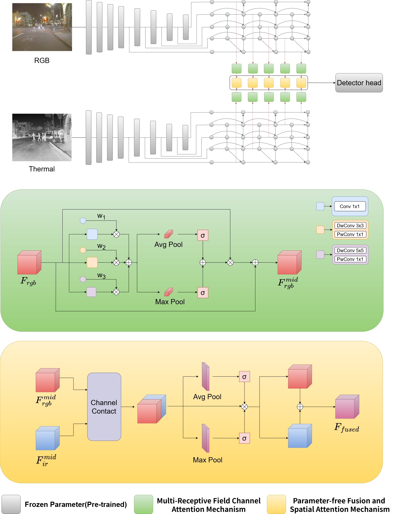

# Enhancing RGB-IR Object Detection: A Frozen Backbone Approach with Multi-Receptive Field Attention
**Enhancing RGB-IR Object Detection: A Frozen Backbone Approach with Multi-Receptive Field Attention**<br>

These codes are directly related to the current manuscript submitted to The Visual Computer: Enhancing RGB-IR Object Detection: A Frozen Backbone Approach with Multi-Receptive Field Attention. <br>

<p align="center">

</p>

## Installation

### Prerequisites
Before starting, install [anaconda](https://docs.conda.io/en/latest/miniconda.html#installing) in order to create a virtual environment and create a new Python 3.12.4 environment using:
```
conda create -n dsfusion python=3.12.4
``` 
- our code has been tested with Python 3.12.4. It is not garuanteed to work with other other versions. 

 Activate the environment and install the necessary packages via:
``` 
conda activate dsfusion 
pip install -r requirements.txt 
```

## Checkpoints
Download model checkpoints from [here](https://drive.google.com/drive/folders/1Exw4_eq8QJgrmgs3gQE9d9mrYim8UHv5?usp=sharing), and directly extract it into the `Checkpoints` folder. The folder should have the following structure:
```
Checkpoints
├── FLIR_Aligned
│   ├── Fusion_Models
│   └── Single_Modality_Models
└── M3FD
    ├── Classifier
    ├── Fusion_Models
    └── Single_Modality_Models
```

## Datasets
Download the FLIR Aligned Dataset from [here](https://drive.google.com/drive/folders/18XmdzKj0sGOFt0r4LmwMo9TsVNpyKEzT?usp=sharing), and extract it into the `Datasets` folder. The folder should have the following structure:
```
Datasets
├── FLIR_Aligned
│   ├── images_rgb_train
│   ├── images_rgb_test
│   ├── images_thermal_train
│   ├── images_thermal_test
│   └── meta
└── M3FD
    ├── Ir
    ├── Vis
    └── meta
```

## Training 
* To train the model on full data of FLIR Aligned Dataset(Full), run the following command:
```
python train_fusion.py Datasets/FLIR_Aligned --dataset flir_aligned_full --thermal-checkpoint-path Checkpoints/FLIR_Aligned/Single_Modality_Models/flir_thermal_backbone.pth.tar --init-fusion-head-weights thermal --num-classes 90 --rgb_mean 0.485 0.456 0.406 --rgb_std 0.229 0.224 0.225 --thermal_mean 0.519 0.519 0.519 --thermal_std 0.225 0.225 0.225 --model efficientdetv2_dt --batch-size=8 --epochs=50 --branch fusion --freeze-layer fusion_mrf --att_type mrf
``` 
* To train the model on full data of M3FD Dataset(Full), run the following command:
```
python train_fusion.py Datasets/M3FD --dataset m3fd_full --rgb-checkpoint-path Checkpoints/M3FD/Single_Modality_Models/m3fd_rgb_backbone.pth.tar --thermal-checkpoint-path Checkpoints/M3FD/Single_Modality_Models/m3fd_thermal_backbone.pth.tar --init-fusion-head-weights thermal --num-classes 6 --rgb_mean 0.49151019 0.50717567 0.50293698 --rgb_std 0.1623529 0.14178433 0.13799928 --thermal_mean 0.33000296 0.33000296 0.33000296 --thermal_std 0.18958051 0.18958051 0.18958051 --model efficientdetv2_dt --batch-size=8 --epochs=50 --branch fusion --freeze-layer fusion_mrf --att_type mrf
```

## Validation
### Validate Single Modality Checkpoins
* To validate the provided Pretrained Thermal checkpoint on M3FD Data(Full), run the following command:  
```
python validate_fusion.py Datasets/M3FD --dataset m3fd_full --thermal-checkpoint-path Checkpoints/M3FD/Single_Modality_Models/m3fd_thermal_backbone.pth.tar --init-fusion-head-weights thermal --classwise --split test --num-classes 6 --rgb_mean 0.49151019 0.50717567 0.50293698 --rgb_std 0.1623529 0.14178433 0.13799928 --thermal_mean 0.33000296 0.33000296 0.33000296 --thermal_std 0.18958051 0.18958051 0.18958051 --model efficientdetv2_dt --batch-size=8 --branch thermal
```

### Validating the Fusion Models

* To validate the provided Pretrained fusion modle checkpoint on Flir Aligned Data(Full), run the following command:  
```
bash bash/val_flir_full.sh
```
* To validate the provided Pretrained fusion modle checkpoint on M3FD Data(Full), run the following command:  
```
bash bash/val_m3fd_full.sh
```
